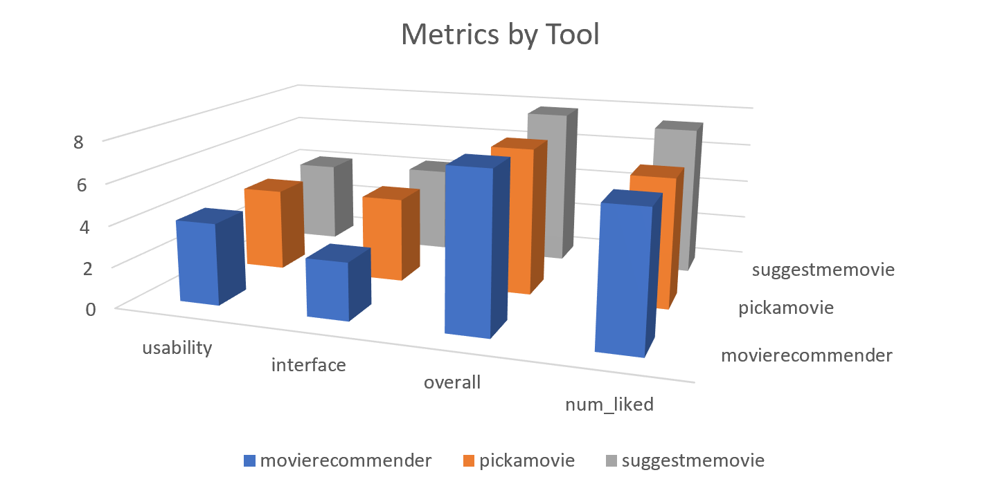
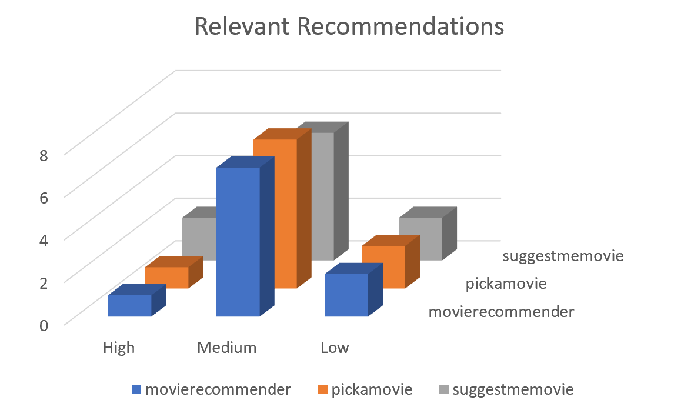
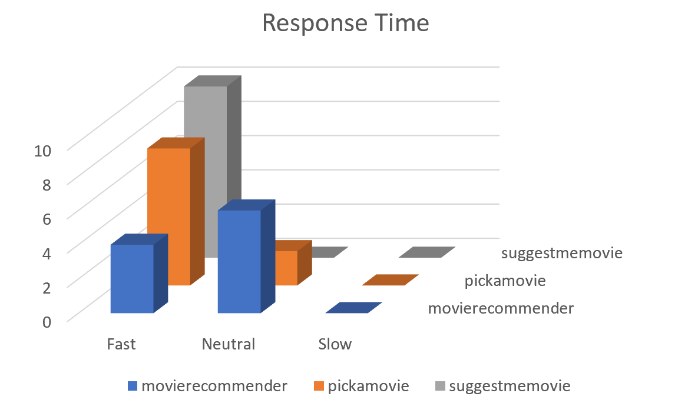
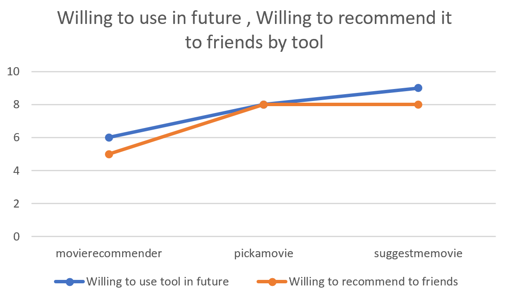
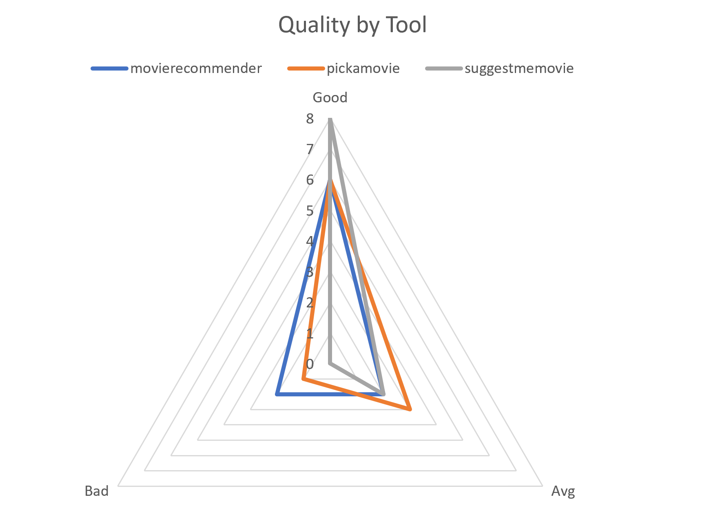

# Results of Project 3

# Methods :

The experiment records few parameters from movie recommender and two other online recommenders(pick a movie and Suggestmemovie) available on the internet :

Parameters used:

1) Usability

2) User interface 

3) The relevance of recommendations

4) Response Time

5) Quality of Recommendations, 

6) Would you use this tool in the future?

7) Would you recommend this to your friends?

8) Overall Experience

9) How many movies liked out of 10 movie recommendations?

By visualizing these parameters, we intend to determine the correlation among these parameters and eliminate the least significant parameters. This could help in determining what affects the user and how can the features be improved to make the tool better.

# Materials:

We have used google sheets and tokens to anonymously collect data from the subjects. The test subjects fill their details in a table. They then pick a key from the available keys in another table and checks the corresponding checkbox.

In this way, we collect the test subjects’ details and protect their anonymity by not recording the keys picked by them. They can then use these keys to record their results.

## Following is the google spreadsheet we used :

https://docs.google.com/spreadsheets/d/10zPGv-nFobwtqdHKpuVHqolQGgxQ8pR8rEqOtA41c1M/edit#gid=1968983071

## Online links :

Movie Recommender: https://github.com/git-ankit/MovieRecommender

Pick a movie: https://pickamovieforme.com/

Suggested me Movie: https://www.suggestmemovie.com/

# Observations

The above visualization provides a comparision between the application that we created and 2 other popular movie recommender websites in terms of usability, interface, overall, number of likes. Users have liked suggestmemovie website better in these aspects as we can see from the results, but this project fares pretty well.

In terms of Relevant Recommendations, All the 3 applications are similar as the users tend to have selected medium in most cases.

In terms of response time, The application we generated is slow compared to others as suggestmemovie and pickamovie are quciker as per the users.

As a whole users are willing to use and recommend the other 2 applications rather than movierecommender, it may be a result of slow response time or reliabilty.

The above visualization provides a overall view of each tools review.

# Conclusion

In conclusion, we find that there is little observed difference between the three movie recommendation sites. At best, this indicates that MovieRecommender is at least equivalent in performance, or slightly superior, to other movie recommendation sites. Most notably, we show that MovieRecommender has very similar performance across usability, interface, overall score, and the number of movies liked in the prediction. Additionally, MovieRecommender is also generally considered to have a higher response time than the two other utilities tested.

# Threats to validity:
### Limited Sample:
The results obtained are based on a sample of 10 people. This is not a sufficient number to arrive at conclusive results. Nevertheless, we commented on some notable trends in the observations. Similar arguments can be made regarding the diversity of the test group.

### Subjective results:
The output of the tool varies from person to person, and the likeability of the suggestions depends on the individual. In short, the results are subjective. There is no way to test if the results are right or wrong. For instance, one subject might randomly enter their observations, and we have no way of identifying this. This alters the patterns in the observations.

### Lack of knowledge of implementation details:
We do not have a holistic picture of what happens under the hood. As a result, the test plan might not be as accurate as it could be.
